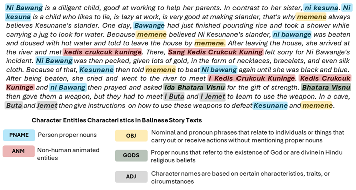
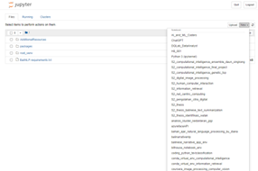
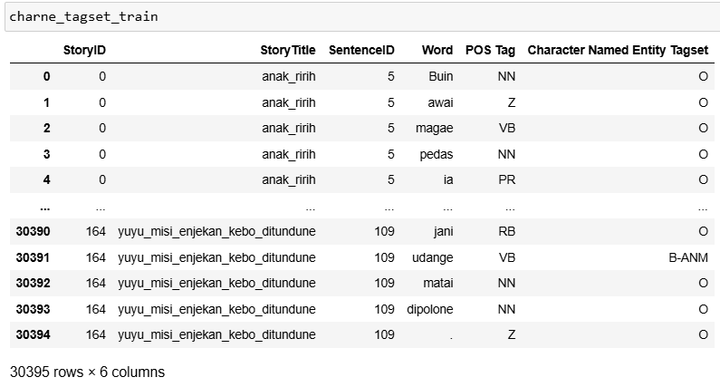
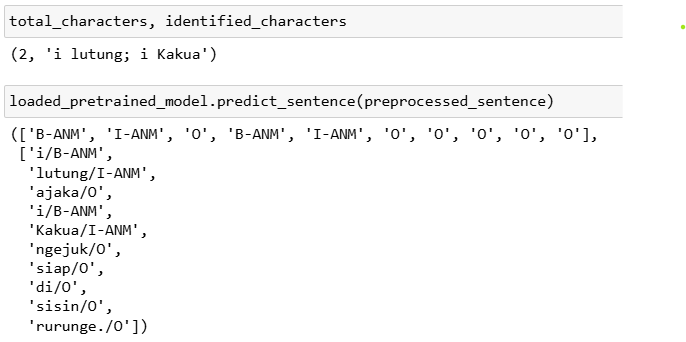
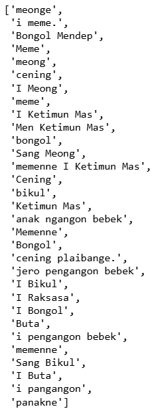
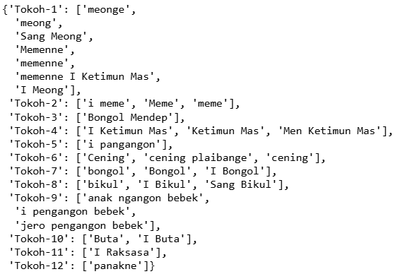
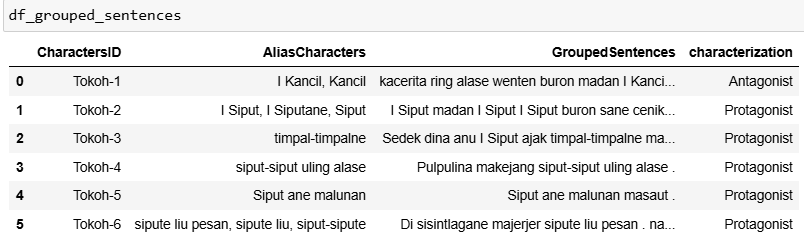
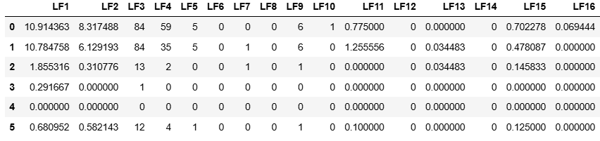

<h1 id='BaliStoryAnalyzer'>BaliStoryAnalyzer v1.0</h1>

[](https://doi.org/10.5281/zenodo.14808602)

The first packcage for Balinese story text analysis tasks developed using Python, including but not limited to:

- Character named entity recognition
- Character identification
- Alias Clustering
- Character Classification (protagonist vs antagonist)

---

<h1 id='citation'>Citation</h1>

If you find this project useful, please cite this github page and the following paper:

1. Bimantara, I. M. S., Purwitasari, D., Er, N. A. S., & Natha, P. G. S. (2024). Balinese story texts dataset for narrative text analyses. _Data in Brief_, _56_, 110781.
2. Bimantara, I. M. S., Sanjaya ER, N. A., & Purwitasari, D. (2023, November). Character Entity Recognition Using Hybrid Binary-Particle Swarm Optimization and Conditional Random Field on Balinese Folklore Text. In _International Conference on Information Integration and Web Intelligence_ (pp. 128-133). Cham: Springer Nature Switzerland.
3. I Made Satria Bimantara, Purwitasari, D., & ER, N. A. S. (2025). A python text mining package for Balinese narrative text understanding. In Character Entity Recognition Using Hybrid Binary-Particle Swarm Optimization and Conditional Random Field on Balinese Folklore Text (v1.0.0). Zenodo. https://doi.org/10.5281/zenodo.14808603

<h1 id='developer_authors'>Developers and Authors</h1>

1. **Main Developer and Author** : I Made Satria Bimantara, S.Kom., M.Kom.
2. Co-author:
   - Prof. Dr. Ir. Diana Purwitasari, S.Kom., MSc.
   - Dr. Ir. Ngurah Agus Sanjaya ER, S.Kom., M.Kom.

Please contact to the **Corresponding author** for further information: satriabimantara.imd@gmail.com (I Made Satria Bimantara)

<h1 id='table_of_contents'>Table of Contents</h1>

- BaliStoryAnalyzer
- Table of Contents
- Features
  - Module (1): Data Preprocessing and Data Preparation
  - Module (2): Character Named Entity Recognition (NER) and Identification
  - Module (3): Alias Clustering
  - Module (4): Character Classification
- Package Folder Structure
- Prerequisite Software
  - Install Python
  - Install IDE (e.g VS Code)
  - Install Git and Github CLI
- BaliStoryAnalyzer Package Installation
  - Package Downloading Guidelines
  - Python virtual environment, jupyter notebook, and IPYkernel setup guidelines
- Package Manual Usage
  - Module (1): Data Preprocessing and Data Preparation
    - How to preprocess your raw dataset?
    - How to prepare/format your raw dataset?
      - Formatting your raw dataset for training character NER model
      - Formatting your raw dataset as character identification ground truth dataset
  - Module (2): Character NER and Character Identification
    - How to train and evaluate the Balinese Character NER model?
    - How to configure active features subsets for training the model?
    - How to save and use the pretrained Balinese Character NER model?
    - How to utilize the provided pretrained Balinese character NER model?
  - Module (3): Alias Clustering
    - How to perform alias clustering task?
  - Module (4): Character Classification
    - How to use our Coreference Resolution class?
    - How to prepare your text features for character classification task (protagonist vs antagonist)?
      - How to use our SentenceGrouping class?
      - How to extract input text features?
    - How to train the supervised learning from extracted features?
- Web-Interface Manual Usage
- Citation
- Contribution
- References
- License
  - BaliStoryAnalyzer package license
  - BaliStoryAnalyzer web-interface license

<h1 id='features'>Features</h1>

BaliStoryAnalyzer v1.0 have several features for Balinese narrative text analysis tasks:

- **Module (1)**: Data Preprocessing and Data Preparation
  This feature can be used to preprocess and prepare your new raw balinese text in uniform format before it can be used further to retrain the models or to be inferenced by our models. We employ DataFrame format as the input for our character named entity recognition model in 2nd module. We provide several functions to preprocess your raw text according to your needs.

- **Module (2)**: Character Named Entity Recognition (NER) and Identification



This feature can be used to recognize any Balinese character named entity appearance in text segment. Our model can recognize five types of entity that can be a character in a Balinese story text: - **_PNAME_**: person proper noun that follow morphological structure in Balinese (e.g:_I Made Satria Bimantara, I Wayan Kopling, I Belog, Ni Sukerti, I Gusti Agung Panji Sakti, Ida Bagus Sugriwa_, etc). - **_ANM_**: non-human animated entity such as animal and plants which have human characteristics or called antrophomorphic objects (e.g _I Lutung_ or the monkey, _I Kekua_ or the turtle, etc). - **_GODS_**: proper nouns that refer to the existence of God are divine in Hindu religious belief (e.g Ida Bhatara Siva, Ida Sang Hyang Wisnu, Bhatara Durga, etc) - **_OBJ_**: nominal and pronoun phrase that relate to individuals or things that carry out or receive actions without mentioning the proper nouns (e.g _memene_ or his/her mom, _dagang nasine ento_ or that rice seller, _pisagane ento_ or that neighbor, etc) - **_ADJ_**: character names are based on certain characteristics, traits, or circumstances (e.g _I Belog_ or the foolish, _I Jemet_ or the diligent person, _I Buta_ or the blind man, etc). - **_O_**: all words/tokens that not recognized as the five entities above will be labelled as others (O)
We use BIO (begin-inside-outside) format to label each words in sequences of words with each corresponding entity. For instance, _I Pekak Dukuh ajak cucune lakar ngejuk I Lutung_ will labelled as _I/**B-PNAME** Pekak/**I-PNAME** Dukuh/**I_PNAME** ajak/**O** cucune/**B-OBJ** lakar/**O** ngejuk/**O** I/**B-ANM** Lutung/**I-ANM** will have three characters named \_I Pekak Dukuh_ as PNAME, _cucune_ as OBJ, and _I Lutung_ as ANM.

- **Module (3)**: Alias Clustering
  The Balinese story writer often use different aliases to call the same character entity. Therefore this module provides feature for grouping the same character entity with various aliases into the same group. Based on that problem, alias clustering (some papers called it with alias resolution or named entity linking) is a cruciall steps as part of the character identification process.
  For instance, character entity named **_I Lutung_** often written as _lutung, lutunge, I lutunge, Lutung_, so these various aliases will grouped into the same group that correspond to the **_I Lutung_** character entity. We refer the "character group" as the collection of various aliases that refer to the specific character entity.

- **Module (4)**: Character Classification
  We develop a simple procedure that can classify the character group into protagonist or antagonist with several text features.
  We provide lexicon-based and word vector feature extractor to extract the relevant features from each character group. We develop **BaliSentiLex** as the first sentiment lexicon for balinese that provide the positive and negative polarity scores of each seed words. We use TF-IDF and Word Embedding as the word vector feature to retrieve the importance word's weight relative to the all corpus and semantic meaning of each words.
  We didn't provide our proposed model here, but we provide the initial corpus (character groups as predictor and its labels as dependent variable) for this task to train your own model. You can use any scikit-learn model or your own supervised learning after these features were extracted.

<h1 id='folder_structure'>Package Folder Structure</h1>
<table id='package-folder-structure'>
<thead>
<tr>
<td> <strong>Path Directory</strong></td>
<td> <strong>Description</strong></td>
</tr>
</thead>
<tbody>
<tr>
<td>BaliStoryAnalyzer (root)</td>
<td>Main path folder that contain BaliStoryAnalyzer dist package</td>
</tr>
<tr>
<td>root/packages</td>
<td>The folder containing the main packages</td>
</tr>
<tr>
<td>root/packages/module1</td>
<td>Module containing preprocessor and data preparation components</td>
</tr>
<tr>
<td>root/packages/module2</td>
<td>Modules for the purpose of character NER and character identification</td>
</tr>
<tr>
<td>root/packages/module3</td>
<td>Modules for the alias clustering task</td>
</tr>
<tr>
<td>root/packages/module4</td>
<td>Module containing workflow for character classification purposes (protagonist vs antagonist)</td>
</tr>
<tr>
<td>root/pretrained-models</td>
<td>A folder containing pre-trained models that users can use directly without having to retrain the model from scratch. </td>
</tr>
<tr>
<td>root/web</td>
<td>Folder containing the web-based user interface for narrative text analysis containing the root/packages implementation.</td>
</tr>
<tr>
<td>root/BalineseStoryTextsDataset</td>
<td>Annotated 120 Balinese story texts dataset for narrative text analysis from <a href='https://data.mendeley.com/datasets/h2tf5ymcp9/3'>previous research</a> so you can retrain your model with the annotated dataset. Please follow the instruction on how to use this dataset in this <a href='https://data.mendeley.com/datasets/h2tf5ymcp9/3'>website</a></td>
</tr>
<tr>
<td>root/python-venv-requirements.txt </td>
<td>File containing a list of python package dependencies that must be installed by the user to be able to run the BaliStoryAnalyzer packages.</td>
</tr>
<tr>
<td>root/README.md</td>
<td>File containing guidelines to using the BaliStoryAnalyzer packages</td>
</tr>
<tr>
<td>root/your_project_repository/</td>
<td>Your project folder or repository including your jupyter notebook (.ipynb) files or python (.py) files should put inside this folder</td>
</tr>
</tbody>
</table>

<h1 id='prerequisite_software'>Prerequisite Software</h1>

<h2 id='install_python'>Install Python</h2>

Please install the Python v3.8.5 for using these packages. Please follow these steps in this [website](https://www.python.org/downloads/release/python-385/) to install Python into your global operating system.

<h2 id='install_ide'>Install IDE (VS Code)</h2>

You can use your own IDE, but we suggest VS Code as your project code editor. Please follow this website to install [VSCode](https://code.visualstudio.com/download).

<h2 id='install_git'>Install Git and Github CLI</h2>

We recommend to use git as your versioning code system and also to download BaliStoryAnalyzer.

- Please follow the Git installation [here](https://git-scm.com/downloads).
- Please follow the Github CLI installation [here](https://cli.github.com/)

<h1 id='balistoryanalyzer_installation'>BaliStoryAnalyzer Package Installation</h1>

## Package downloading guidelines

1. Create a new directory in your local disk, for instance, `D:\myproject`. Enter your directory as your main project folder.
2. Open your terminal (CMD in Windows) and navigate to the previous directory. You can download our BaliStoryAnalyzer with three approaches.

- **Via `gh repo clone`**
  - Run authorization first by login into your github account: `gh auth login`
  - Start clone our packages: `gh repo clone satriabimantara/BaliStoryAnalyzer`
- **Via `git pull origin <branch_master>`**
  - Initialize this directory as git repository by typeing: `git init`
  - Add our remote url to this project folder: `git remote add origin https://github.com/satriabimantara/BaliStoryAnalyzer.git`
  - Pull our codes: `git pull origin master`
- **Via zip**
  - Download our package from our github and then download it in _zip_ format. Extract this zip folder into your current working directory.

3. **BaliStoryAnalyzer** packages will show in your `D:\myproject` directory by following both approaches. Double click to this directory. Now you are in `D:\myproject\BaliStoryAnalyzer\` and the packages structure will follow the [previous description](#package-folder-structure). You can start to code in `D:\myproject\BaliStoryAnalyzer\your_project_repository` or anywhere inside _BaliStoryAnalyzer_ folder by following the packages guidelines.

## Python Virtual Environment, Jupyter Notebook, and IPYkernel setup guidelines

We encourage you to create a new python virtual environtment every new project to avoid dependencies conflict.

1. Open your terminal and go to `D:\myproject\BaliStoryAnalyzer\` .
2. Create a new python virtual environtment named **root_venv** by running: `python -m venv root_venv`. This will create virtual environtment folder with python v3.8.5.
3. Activate the **root_venv**: `root_venv\Scripts\activate.bat`.
4. Install all the required dependencies in _python-venv-requirements.txt_ file by running: `pip3 install -r "python-venv-requirements.txt"`. We have included all the required packages dependencies including **Jupyter Notebook** and **IPYkernel**.
5. Register a new kernel with desired named (e.g balistoryanalyzer_kernel) into your local jupyter notebook environtment: `python -m ipykernel install --user --name=balistoryanalyzer_kernel`
6. Open jupyter notebook from your current terminal by running: `jupyter notebook`. It will open the jupyter notebook locally in your machine as your IDE for creating new python notebook. Anytime you create a new notebook, select the _balistoryanalyzer_kernel_ as your python kernel.



7. Now you are ready to call and explore our **BaliStoryAnalyzer** package from the created notebook.

<h1 id='package_manual_usage'>Package Manual Usage</h1>

## Module 1 (Data Preprocessing and Data Preparation)

### How to preprocess your raw dataset?

1. Create a new jupyter notebook file on your current root project directory, for instance **example1.ipynb** in `D:\myproject\BaliStoryAnalyzer\your_project_repository\` path
2. Import all required libraries including the **_TextPreprocessor_** class:

```
import sys
sys.path.append('../packages/module1/')
from TextPreprocessor import *
```

3. Load new raw Balinese text. We use \*.txt format for our tutorial:

```
DATASET_PATH_FOLDER = "../BalineseStoryTextsDataset/raw/Anak Ririh.txt"
text = open(DATASET_PATH_FOLDER, 'r').read()
```

4. Call the required function as you need to preprocess your text from our preprocessor class.

```
# convert special characters to ASCII
preprocessed_text = TextPreprocessor.convert_special_characters(text)

# normalized typography Balinese Word
preprocessed_text = TextPreprocessor.normalize_words(preprocessed_text)

# remove any double tab
preprocessed_text = TextPreprocessor.remove_tab_characters(preprocessed_text)

# remove special punctuation
preprocessed_text = TextPreprocessor.remove_special_punctuation(preprocessed_text)

# remove standard string punctuation
preprocessed_text = TextPreprocessor.remove_punctuation(preprocessed_text)

# remove exclamation word or expression word
preprocessed_text = TextPreprocessor.remove_exclamation_words(preprocessed_text)

# give enter to end of each sentence
preprocessed_text = TextPreprocessor.add_enter_after_period_punctuation(preprocessed_text)

# left and right strip your string
preprocessed_text = TextPreprocessor.remove_leading_trailing_whitespace(preprocessed_text)

# remove any double or multiple whitespace
preprocessed_text = TextPreprocessor.remove_whitespace_multiple(preprocessed_text)
```

### How to prepare/format your raw dataset?

<h4 id='format_ner_tagset'>Formatting your raw dataset for training character NER model</h4>

1. Import the required libraries and register our `DataPreparation` class

```
import pandas as pd
import sys
sys.path.append('../packages/module1/')

from DataPreparation import DataPreparation
```

2. Prepare your Balinese raw dataset in pandas DataFrame format which contain two important columns, i.e **story_title** and **story_text**

```
raw_df = pd.DataFrame({
    'story_title': ['I Siap selem'],
    'story_text': ['Kacerita ada kambing madan Ni Mésaba ngajak Ni Wingsali. Ia luas ka alasé, ngalih amah-amahan ané nguda-nguda. Panakné Ni Wingsali masih bareng ka alasé.']
})
```

3. Instantiate our class and call the function `.format_ner_tagset()`. For detail explanation, please read this function's docstring in our class.

```
dataprep = DataPreparation()
formatted_ner_tagset = dataprep.format_ner_tagset(raw_df)
```

4. You can manually annotated this ner tagset in **Tag** column with [five character named entities](#features) using BIO format and then train your own models.

<h4>Formatting your raw dataset as character identification ground truth dataset</h4>

1. Import the required libraries and register our `DataPreparation` class

```
import pandas as pd
import sys
sys.path.append('../packages/module1/')

from DataPreparation import DataPreparation
```

2. Prepare your Balinese raw dataset in pandas DataFrame format which contain two important columns, i.e **story_title** and **story_text**

```
raw_df = pd.DataFrame({
    'story_title': ['I Siap selem'],
    'story_text': ['Kacerita ada kambing madan Ni Mésaba ngajak Ni Wingsali. Ia luas ka alasé, ngalih amah-amahan ané nguda-nguda. Panakné Ni Wingsali masih bareng ka alasé.']
})
```

3. Instantiate our class and call the function `.format_character_identification_dataset()`. For detail explanation, please read this function's docstring in our class.

```
dataprep = DataPreparation()
formatted_chars_identification_df = dataprep.format_character_identification_dataset(raw_df)
```

4. You can manually annotated the ground truth and evaluate your trained model performance using this formatted ground truth dataset.

## Module 2 (Character NER and Character Identification)

- We had developed a toolkit for character NER in Balinese Story Text using several machine learning models, such as Conditional Random Field (CRF), Hidden Markov Model (HMM), and Support Vector Models (SVM). By default, our CRF and SVM model is trained using all the features (19 features with three categories of features: word features, pos tag features, and orthographic features). Furthermore, we also had created a hybrid CRF model with Binary Particle Swarm Optimization (BPSO) named **SatuaNER** or **BPSO-CRF** which is CRF model that is trained using the best feature subset from BPSO learning phase. Please refer to the published [conference paper](https://link.springer.com/chapter/10.1007/978-3-031-48316-5_15).
- In addition, you can pass any **scikit-learn** classifier models (supervised learning), such as _K-Nearest Neighbor_, _Decision Tree_, _XGBoost_, _Naive Bayes_, _Ensemble Learning_, etc into our class named **ScikitLearnClassifiers** instead of using our default _SVM_ model. Please visit this site [https://scikit-learn.org/stable/supervised_learning.html](https://scikit-learn.org/stable/supervised_learning.html) for extensive explanation about the allowed models.

### How to train and evaluate the Balinese Character NER model?

1. You can use the annotated dataset from [Balinese Story Texts Dataset](https://data.mendeley.com/datasets/h2tf5ymcp9/3) in **/charsNamedEntity/** subfolder or you can use the formatted train data by following previous steps. The important notes is you must provide three columns: _word_, _POS Tag label_, and _CHAR NE label_ as the target in DataFrame format (you can imitate the example data from _BalineseStoryTextsDataset/charsNamedEntity/_ folder. For this tutorial, we will use the data from **BalineseStoryTextsDataset/charsNamedEntity/** folder.
2. Import the required libraries and register our **_packages/_** folder to sys.path

```
import pandas as pd
import sys
sys.path.append("../packages/")
```

3. Import our character NER model

```
# baseline CRF model
from module2 import ConditionalRandomFields as CRF
# HMM model
from module2 import HiddenMarkovModel as HMM
# Blueprint class for using scikit-learn supervised learning, by default it will use SVM model with default hyperparameter
from module2 import ScikitLearnClassifiers
# Our hybrid model BPSO-CRF
from module2 import HybridBPSOCRF as SatuaNER
```

4. Load your formatted dataset here.

```
PATH_TO_YOUR_DATASETS = "../BalineseStoryTextsDataset/charsNamedEntity/"
charne_tagset_train = pd.read_excel(PATH_TO_YOUR_DATASETS + "/train.xlsx")
charne_tagset_test = pd.read_excel(PATH_TO_YOUR_DATASETS + "/test.xlsx")
```



5. Create an object from our model class.

- Train using **CRF**

  ```
  # instantiate the object
  my_crf_model = CRF()

  # fit the train data
  my_crf_model.fit(charne_tagset_train)

  # Evaluate the model performance on train and test data
  y_pred_test_crf= my_crf_model.predict(charne_tagset_test)

  # print evaluation results
  train_evaluation_crf_model, test_evaluation_crf_model = my_crf_model.evaluate(
      my_crf_model.Y_TRAIN,
      my_crf_model.y_pred_train,
      my_crf_model.Y_TEST,
      my_crf_model.y_pred_test
  )

  # print classification report
  my_crf_model.classification_report(
      my_crf_model.Y_TRAIN,
      my_crf_model.y_pred_train,
      my_crf_model.Y_TEST,
      my_crf_model.y_pred_test,
  )
  ```

- Train using **HMM**

  ```
  # instantiate the object
  my_hmm_model = HMM()

  # fit the train data
  my_hmm_model.fit(charne_tagset_train)

  # Evaluate the model performance on train and test data
  y_pred_test_hmm= my_hmm_model.predict(charne_tagset_test)

  # print evaluation results
  train_evaluation_hmm_model, test_evaluation_hmm_model = my_hmm_model.evaluate(
      my_hmm_model.Y_TRAIN,
      my_hmm_model.y_pred_train,
      my_hmm_model.Y_TEST,
      my_hmm_model.y_pred_test
  )

  # print classification report
  my_hmm_model.classification_report(
      my_hmm_model.Y_TRAIN,
      my_hmm_model.y_pred_train,
      my_hmm_model.Y_TEST,
      my_hmm_model.y_pred_test,
  )
  ```

- Train using **ScikitLearnClassifiers** and SVM model

  ```
  # import svm classifier class from scikit-learn
  from sklearn.svm import SVC

  # instantiate the object
  my_svm_model = ScikitLearnClassifiers(
      scikit_learn_model={
          'model': SVC(), # keep it default, you can change the SVM's hyperparameter or the learning model through this function's parameter
          'model_name': 'svm_model', # name your model here
          'sparse_to_dense': False
      }
  )

  # fit the train data
  my_svm_model.fit(charne_tagset_train)

  # Evaluate the model performance on train and test data
  y_pred_test_svm= my_svm_model.predict(charne_tagset_test)

  # print evaluation results
  train_evaluation_svm_model, test_evaluation_svm_model = my_svm_model.evaluate(
      my_svm_model.Y_TRAIN,
      my_svm_model.y_pred_train,
      my_svm_model.Y_TEST,
      my_svm_model.y_pred_test
  )

  # print classification report
  my_svm_model.classification_report(
      my_svm_model.Y_TRAIN,
      my_svm_model.y_pred_train,
      my_svm_model.Y_TEST,
      my_svm_model.y_pred_test,
  )
  ```

- Train using **SatuaNER**

  - SatuaNER basically is CRF model that is optimized using BPSO to choose the best combination of feature subset (which features are turned on and the rest are turned off). You can replace the optimization method with other optimization models or metaheuristic algorithms to optimize these subsets.

  ```
  # prepare your train and val dataset with required format
  ...

  # instantiate BPSO object
  bpso_model = SatuaNER()

  # fit the train data
  bpso_model.fit(charne_tagset_train, charne_tagset_val)

  # run optimization process
  bpso_results = bpso_model.run()

  # get the train and validation optimization results
  bpso_train_results, bpso_validation_results = bpso_results['train'], bpso_results['validation']

  # !important, retrieve the best feature subset configuration
  best_feature_encoding = bpso_validation_results['bestFeatures']
  ```

  - After that load the optimized subset to the CRF model or our other models

  ```
  # configure our CRF with activated features
  my_crf_model = CRF(
  	feature_encoding=best_feature_encoding
  )

  # continue the rest of the codes
  # ....
  ```

### How to configure active feature subsets for training the model?

- To configure which features are activated (True) or non-activated (False), you can configure through **_feature_encoding_** parameter in certain model class while you initializing the object. For detail explanation about the extracted features, please refer to this [paper](https://link.springer.com/chapter/10.1007/978-3-031-48316-5_15).

```
FEATURE_ENCODING = {
	'w[i]': True,
	'w[i].lower()': False,
	'surr:w[i]': True,
	'surr:w[i].lower()': False,
	'pref:w[i]': False,
	'suff:w[i]': False,
	'surrPreff:w[i]': False,
	'surrSuff:w[i]': False,
	'w[i].isLessThres': True,
	'w[i].isdigit()': False,
	'surr:w[i].isdigit()': True,
	'w[i].isupper()': False,
	'surr:w[i].isupper()': False,
	'w[i].istitle()': False,
	'surr:w[i].istitle()': False,
	'w[i].isStartWord()': False,
	'w[i].isEndWord()': False,
	'pos:w[i]': True,
	'surrPos:w[i]': True
}

# configure our CRF with activated features
my_crf_model = CRF(
	feature_encoding=FEATURE_ENCODING
)

# continue the rest of the codes
# ....
```

<h3 id='save_use_pretrained_charne_models'>How to save and use the pretrained Balinese Character NER model?</h3>

1. After you complete your model training process, you can save your pretrained model for later purpose in pickle format (.pkl).

```
my_crf_model.save(
    saved_model = {
        'model': my_crf_model
    },
    path_to_save = "../folder_to_save_your_pretrained",
    filename = "pretrainedmodel_filename.pkl"
)
```

2. You can use your pretrained model to inference new data

```
import pickle

# call your pretrained model
pretrained_model = pickle.load(open("../folder_to_save_your_pretrained/pretrainedmodel_filename.pkl", 'rb'))['model']

# preprocess your text input
...

# example preprocess text
preprocessed_sentence = "i lutung ajaka i Kakua ngejuk siap di sisin rurunge."

# inference from sentence to get CHAR NE label (y_pred)
y_pred, token_with_predicted_tag = pretrained_model.predict_sentence(preprocessed_sentence)

# inference from sentence to identify character names
total_characters, identified_characters = pretrained_model.extract_predicted_characters_from_sentence(
    sentence=preprocessed_sentence,
    y_pred=y_pred).values()
```



<h3 id='utilise_provided_pretrianed_charne_model'>How to utilize the provided pretrained character NER models?</h3>

> Please extract the zip folder (<strong>pretrained-models.zip</strong>) first

- We provide our five pretrained character identification models in **pretrained-models/character-identification** folder in pickle (<strong>.pkl</strong> format. You can choose one of them because the steps to identify and extract from all pretrained character identification models were similar. The difference is the model/algorithm behind them.
- In each pretrained model files, there were two pretrained models, i.e **m1** and **m2**.
  - **M1 pretrained model** was trained using the best training fold subset that gave the highest F1-score on validation fold from 10-fold cross-validation. For instance, 7th training fold when trained to CRF achieving the highest score in 7th validation fold, so we keep this pretrained model as M1-CRF.
  - **M2 pretrained model** was trained using all training data subset rather was trained only using a subset of any training fold.
- You can choose which pretrained model you are going to use, either M1 or M2. Both of them give good performance, but in generall, pretrained M2 models give the F1-score higher than M1 due to it is trained using diverse data.

1. Import the required libraries and register our package

```
import pandas as pd
import pickle

# please include our BaliStoryAnalyzer package first in your sys path
import sys
sys.path.append("../packages/")
```

2. Load the pretrained character identification models

```
# load our pretrained SatuaNER model
path_to_filename = "../pretrained-models/character-identification/BPSOCRF/pretrained_best_model.pkl"
history_satuaner = pickle.load(open(path_to_filename, 'rb'))
pretrained_m1_satuaner = history_satuaner['optimal_best_fold_model']['model']
pretrained_m2_satuaner = history_satuaner['optimal_best_all_train_model']

# load our pretrained CRF model
path_to_filename = "../pretrained-models/character-identification/CRF-2/pretrained_best_model.pkl"
history_crf2 = pickle.load(open(path_to_filename, 'rb'))
pretrained_m1_crf2 = history_crf1['optimal_best_fold_model']['model']
pretrained_m2_crf2 = history_crf1['optimal_best_all_train_model']

# load our pretrained HMM model
path_to_filename = "../pretrained-models/character-identification/HMM/pretrained_best_model.pkl"
history_hmm = pickle.load(open(path_to_filename, 'rb'))
pretrained_m1_hmm = history_hmm['optimal_best_fold_model']['model']
pretrained_m2_hmm = history_hmm['optimal_best_all_train_model']

# load our pretrained SVM model
path_to_filename = "../pretrained-models/character-identification/SVM/pretrained_best_model.pkl"
history_svm = pickle.load(open(path_to_filename, 'rb'))
pretrained_m1_svm = history_svm['optimal_best_fold_model']['model']
pretrained_m2_svm = history_svm['optimal_best_all_train_model']
```

3. You can identify the characters by running preprocessing steps to your raw input text first and then call the function from our pretrained models. You can either identify from a sentence or from whole paragraphs.

- From whole paragraphs:

  ```
  # include our text preprocessor class
  from module1.TextPreprocessor import *

  # import our BaseModel class for character identification using pretrained model
  from module2 import BaseModel

  # load your raw text
  sample_raw_story = open('../BalineseStoryTextsDataset/raw/Arjuna Nangun Tapa.txt', 'r').read()

  # define the text preprocessing steps
  def text_preprocessing(text):
      preprocessed_text_input = TextPreprocessor.convert_special_characters(text)
      preprocessed_text_input = TextPreprocessor.normalize_words(preprocessed_text_input)
      preprocessed_text_input = TextPreprocessor.remove_tab_characters(preprocessed_text_input)
      preprocessed_text_input = TextPreprocessor.remove_special_punctuation(preprocessed_text_input)
      preprocessed_text_input = TextPreprocessor.remove_punctuation(preprocessed_text_input)
      preprocessed_text_input = TextPreprocessor.remove_exclamation_words(preprocessed_text_input)
      preprocessed_text_input = TextPreprocessor.add_enter_after_period_punctuation(preprocessed_text_input)
      preprocessed_text_input = TextPreprocessor.remove_leading_trailing_whitespace(preprocessed_text_input)
      preprocessed_text_input = TextPreprocessor.remove_whitespace_multiple(preprocessed_text_input)

    # preprocess your raw story
  preprocessed_story = text_preprocessing(sample_raw_story)

  # call the function to identify character and pass your preprocessed text and your pretrained model
  list_of_identified_characters = BaseModel.identify_characters(
      preprocessed_story = preprocessed_story,
      pretrained_model= pretrained_m2_satuaner
  )
  ```

- From sentence: Do the same process for character identification using the pretrained models as [previous explanation](#save_use_pretrained_charne_models).

## Module 3 (Alias Clustering)

- We had investigated that Balinese story texts have the same characteristics with English literature where the story's writers usually present a character entity with many various aliases. For instance, a character entity named **Arjuna** in story text entitled _Arjuna Nangun Tapa_ is presented by various aliases, such as **Sang Arjuna**, **I Arjuna**, **Arjunane**, **Sang Arjunane**, or even the writers write aliases with different types of typography. For instance, **I Arjuna** and **i arjuna**
- In this package, we also included the "AliasClustering" specific to the Balinese Story Texts. We had developed our AliasClustering package using some deterministic rules and combined with five different pairwise distance string algorithm:
  - Ratcliff-Obershelp ([https://docs.python.org/3/library/difflib.html#difflib.SequenceMatcher](https://docs.python.org/3/library/difflib.html#difflib.SequenceMatcher))
  - Jaccard Similarity (
  - Sorensen-dice similarity
  - Jaro similarity
  - Jaro winkler similarity ([https://pypi.org/project/jaro-winkler/](https://pypi.org/project/jaro-winkler/))
- Our **AliasClustering** package will need a list of identified characters from a story text. So the first step is identifying all character entities from a given story text. To do so, we need running **Module (2) - Balinese Character NER** package from initial or simply you can utilize our pretrained character identification model
<h3 id='perform_alias_clustering_task'>How to perform alias clustering task?</h3>

1. Import the required packages

```
# package to load/save pretrained model
import pickle

# include our package first into sys path
import sys
sys.path.append('../packages/')
```

2. Registed our packages into sys

```
# call our AliasClustering package
from AliasClustering import AliasClusteringRuleBased

# call our TextPreprocessor package
from module1.TextPreprocessor import *

# call our BaseModel to identify list of character from a given story text utilizing a pretrained model
from module2 import BaseModel
```

3. Load and preprocess your input (raw) text

```
# load your raw Balinese dataset here in string format
sample_raw_story = open('../BalineseStoryTextsDataset/raw/Timun Mas.txt', 'r').read()

# functions for preprocessing your raw story first
def text_preprocessing(text):
    preprocessed_text_input = TextPreprocessor.convert_special_characters(text)
    preprocessed_text_input = TextPreprocessor.normalize_words(preprocessed_text_input)
    preprocessed_text_input = TextPreprocessor.remove_tab_characters(preprocessed_text_input)
    preprocessed_text_input = TextPreprocessor.remove_special_punctuation(preprocessed_text_input)
    preprocessed_text_input = TextPreprocessor.remove_punctuation(preprocessed_text_input)
    preprocessed_text_input = TextPreprocessor.remove_exclamation_words(preprocessed_text_input)
    preprocessed_text_input = TextPreprocessor.add_enter_after_period_punctuation(preprocessed_text_input)
    preprocessed_text_input = TextPreprocessor.remove_leading_trailing_whitespace(preprocessed_text_input)
    preprocessed_text_input = TextPreprocessor.remove_whitespace_multiple(preprocessed_text_input)
    return preprocessed_text_input

preprocessed_story = text_preprocessing(sample_raw_story)
```

4. Use your pretrained character identification model or simply you can use our provided pretrained character identification model.

```
# load your pretrained character identification model
...

# load our pretrained SatuaNER model (skip if you've already load yours)
path_to_filename = "../pretrained-models/character-identification/BPSOCRF/pretrained_best_model.pkl"
history_satuaner = pickle.load(open(path_to_filename, 'rb'))
pretrained_m1_satuaner = history_satuaner['optimal_best_fold_model']['model']
pretrained_m2_satuaner = history_satuaner['optimal_best_all_train_model']
```

5. Identify list of characters using BaseModel class

```
list_of_identified_characters = BaseModel.identify_characters(
    preprocessed_story = preprocessed_story,
    pretrained_model= pretrained_m2_satuaner #you can also use pretrained_m1_satuaner
)
```



6. Run our **AliasClustering** package. There are two parameters, i.e _pairwise_distance_ and _avg_threshold_similarity_. The output is a dictionary key-value pairs, with key is character_ID and the values is all the aliases of corresponding character_ID.

- _pairwise_distance_: Algorithm used in calculating pairwise distance string similarity. Default value is _ratcliff_. Other options:
  - 'ratcliff',
  - 'jaccard',
  - 'sorensen-dice',
  - 'jaro-distance', '
  - jaro-winkler'
- _avg_threshold_similarity_: The average threshold for determining whether a string belongs to a certain group. Ranges from 0.1 to 1

```
# create object from our class
aliasclustering_model = AliasClusteringRuleBased(
    pairwise_distance='sorensen-dice',
    avg_threshold_similarity=0.75,
)

# fit a list of identified characters (collected manually or retrieved from pretrained character identification model)
aliasclustering_model.fit(list_of_identified_characters)

# run cluster() method
results = aliasclustering_model.cluster()

# print the resutls
print(results)
```



## Module 4 (Character Classification)

<h3 id='use_coreference_class'>How to use our Coreference Resolution class?</h3>

- We had built a Rule-based Coreference Resolution for Balinese text. You can access this function in **module4** in the provided package.
- In this coreference resolution model, the model will replace these balinese pronouns (i.e ['ia', 'ida', 'iya', 'dane', 'cai', 'nyai']) with corresponding character entity for its pronouns.
- **Input**: You must provide list of preprocessed sentences from a story as an input for our model. For this demonstration, we will use preprocessed stories from **BalineseStoryTextsDataset/preprocessed/** folder. You can use any raw Balinese stories and do the same preprocessing steps as mentioned in previous explanation on [how to use pretrained character identification models](#utilise_provided_pretrianed_charne_model)

1. Import the required packages and register our package

```
# used for load our pretrained character identification model
import pickle

# register our package module here
import sys
sys.path.append('../packages/CharacterClassificationModule/')
from CoreferenceResolution.CoreferenceResolution import CoreferenceResolution
```

2. Load the list of preprocessed sentences

```
# collect each sentence and put into list,ignore the empty string
sample_list_of_preprocessed_sentences = [
    sentence.strip() for sentence in open('../BalineseStoryTextsDataset/preprocessed/I Siput lawan I Kancil.txt', 'r').read().split('\\n') if sentence !=''
]
```

3. Load your pretrained character identification model for resolving character entity in our Coreference resolution process. Please refer to the [previous explanation](#save_use_pretrained_charne_models)

```
# load your pretrained character identification model
pretrained_character_identification_model = ...
```

4. Instantiate our Coreference Resolution class, fit and predict the input list of sentences. You can pass your pretrained character identification model or simply you can use our pretrained character identification model by passing the value of _characters_identification_pretrained_model_ with **satuaner, svm, hmm,** or **crf**.

```
# create coreference resolution object using your pretrained character identification model
coref_model = CoreferenceResolution(
	characters_identification_pretrained_model=pretrained_character_identification_model
)

# or create coreference resolution object using our pretrained character identification model
coref_model = CoreferenceResolution(
	characters_identification_pretrained_model='satuaner'
)

# fit our coreference model with list of sentences
coref_model.fit(sample_list_of_preprocessed_sentences)

# predict
coreferenced_sentences = coref_model.predict()
```

<h3>How to preprare your text features for character classification task (protagonist vs antagonist)?</h3>

<h4 id='use_sentence_grouping_class'>How to use our Sentence Grouping class?</h4>

- "Sentence Grouping" is used to collect and group any sentences containing and referring certain character group (characters and its various aliases). For example:
  - Character group <Sang Arjuna, I Arjuna, Arjunane, Arjuna> will have list of sentences that refer or contain these aliases in their sentence, so this list of sentences can be used to classify the role of this character group <Sang Arjuna, I Arjuna, Arjunane, Arjuna> into certain dimension, such as _protagonist_ or _antagonist_ by extracting any relevant text features.
- **Input**: You must provide **a list of preprocessed sentences** and **a list of character groups** of a story.

  - _List of preprocessed sentences_: you can follow the previous explanation on how to collect the list of [preprocessed sentences](#use_coreference_class)
  - _List of character groups_: you can run [Alias Clustering steps](#perform_alias_clustering_task) to receive the key-value pairs of character groups or you can use the list of character groups from **BalineseStoryTextDataset/charsAliasClustering** ground truth dataset for demonstration.

  ```
  from pandas import read_excel
  df_character_groups = read_excel("../BalineseStoryTextsDataset/charsAliasClustering/I Siput Lawan I Kancil.xlsx")

  # formatting your data structure to create a list of character groups
  characters_alias_clustering = df_character_groups.groupby('CharactersID')['AliasCharacters'].apply(list).to_dict()
  characters_alias_clustering = dict([
      (k,[tokoh.strip() for tokoh in v[0].split(',')]) for k,v in characters_alias_clustering.items()
  ])
  ```

- **Parameters**:
  - use_coreference_resolution: (Boolean)
    - Using coreference resolution on sentences when the value is True
  - add_characterization_column: (Boolean)
    - Add a characterization column for each character groups to the dataframe with an initial NaN value. This is beneficial when you are thinking to create a training dataset for you classifier to classify each character groups's role. If value is **True** the initial values is list of _NaN_, but if you wish to add your list of characterization, you can pass it in fit() methods in _characters_characterization_ parameter.
  - path_saved_file: (String)
    - Path of the folder where the resulting sentence grouping by default files are saved in **_ROOT_PATH_DIRECTORY\\temp\\_** folder
  - filename: (String)
    - Filename in .xlsx format. Please provide the extension at the end.
- **Process**:

1. Register our package

```
import sys
sys.path.append('../packages/CharacterClassificationModule/')
from SentenceGrouping import SentenceGrouping
```

2. Retrieve the list of preprocessed sentences

```
# collect the list of preprocessed sentences
sample_list_of_preprocessed_sentences = ...
```

4. Run sentence grouping

```
# create object model
sent_group_model = SentenceGrouping(
    use_coreference_resolution=True, # you can change this value with False
    add_characterization_column=True,
    filename='MySentenceGroupingResult.xlsx'
)

# fit your object with inputs
sent_group_model.fit(
    sentences= sample_list_of_preprocessed_sentences,
    characters_alias_clustering = characters_alias_clustering,
    characters_characterization = ['Antagonist','Protagonist','Protagonist','Protagonist','Protagonist','Protagonist'] # example list of characterization when *add_characterization_column is True, or you can pass this parameter as NaN
)

# run predict method
df_grouped_sentences = sent_group_model.predict()
```

 5. Save your sentence grouping results

```
# you can save your result by call save() method, make sure your filename is filled
sent_group_model.save()
```

<h4 id='extract_input_text_features_chars_classification'>How to extract input text features </h4>

> You must run <strong>Sentence Grouping</strong> process first

- You can utilize our **FeatureExtraction** class in _CharacterClassification_ module to extract **Lexicon-based features** and **Word vector features** (i.e TF-IDF and Word Embedding).
  - We also had provided BaliStoryAnalyzer package with the first Balinese sentiment lexicon in _AdditionalResources/BaliSentiLex.xlsx_. The BaliSentiLex is constructed addopting the prior research [[1]](https://dl.acm.org/doi/abs/10.1145/3425632) that utilized the _SentiWordNet_ to extract positive and negative polarities from certain opinion words. We didn't conduct full steps explained in prior research, but we only had finished three main steps to create our BaliSentiLex: (a) Balinese vocabularies construction; (b) Balinese initial seed words construction; and (c\) Dictionary-based lexicon expansion involving synonym relation, antonym relation, and stemming term expantion. Basically, you can load the **BaliSentiLex.xlsx** using **read_excel** from _pandas.DataFrame_ class.
  - We had also provided this package with pretrained Balinese word embedding vector in FastText and Word2Vec architectures (please refer to _pretrained-models/balinese-wordembedding/_ subfolder).
- **Input**: You must provide a dataframe (saved with \*.xlsx format) from the [sentence grouping process](#use_sentence_grouping_class).
- **Output**: Our **FeatureExtraction** class will output a list of text features in numeric vector format.
- **Process**:

1. Import the required libraries and register our class

```
from pandas import read_excel
import sys
sys.path.append('../packages/module1/')
sys.path.append('../packages/module4/')

from TextPreprocessor import *
from FeatureExtraction import LexiconFeatureExtraction, POSTagFeatureExtraction,WordEmbeddingFeatureExtraction
```

2. Load your sentence grouping result

```
df_sentence_grouping_result = read_excel('../temp/MySentenceGroupingResult.xlsx')
```

3. Lexicon-based features extraction

- Import our BaliSentiLex

  ```
  # load balisentilex
  baliSentiLex = read_excel("../AdditionalResources/BaliSentiLex.xlsx")

  # read only rows with sentiment scores
  baliSentiLex_terms = list(baliSentiLex['balinese_term'])
  baliSentiLex_tags = list(baliSentiLex['tags'])
  baliSentiLex_positive_scores = list(baliSentiLex['AveragePositiveScore'])
  baliSentiLex_negative_scores = list(baliSentiLex['AverageNegativeScore'])
  ```

- Preprocessed your grouped sentence first
  ```
  # preprocess this text according to your needs
  df_sentence_grouping_result['preprocessed_grouped_sentence'] = df_sentence_grouping_result['GroupedSentences'].apply(TextPreprocessor.case_folding)
  df_sentence_grouping_result['preprocessed_grouped_sentence'] = df_sentence_grouping_result['preprocessed_grouped_sentence'].apply(TextPreprocessor.remove_period_punctuation)
  df_sentence_grouping_result['preprocessed_grouped_sentence'] = df_sentence_grouping_result['preprocessed_grouped_sentence'].apply(lambda x: x.replace('-',' '))
  df_sentence_grouping_result['preprocessed_grouped_sentence'] = df_sentence_grouping_result['preprocessed_grouped_sentence'].apply(TextPreprocessor.remove_whitespace_LT)
  # df_sentence_grouping_result['lemmatized_preprocessed_grouped_sentence'] = df_sentence_grouping_result['preprocessed_grouped_sentence'].apply(TextPreprocessor.lemmatize_text)
  ```
- Run feature extraction process

  ```
  # create an object model
  lexicon_feature_model = LexiconFeatureExtraction(
      lexicons={
              'lexicon_terms': baliSentiLex_terms,
              'lexicon_tags': baliSentiLex_tags,
              'lexicon_positive_scores': baliSentiLex_positive_scores,
              'lecixon_negative_scores': baliSentiLex_negative_scores
      },
      text_column_to_extracted='preprocessed_grouped_sentence'
  )


  # fit your desired dataframe
  lexicon_feature_model.fit(df_sentence_grouping_result)

  # transform your desired dataframe into list of vectorized lexicon features
  X_lexicon = lexicon_feature_model.transform()
  ```

- Output: You will have 16-d lexicon features from 6 character groups from a story entitled with _I Siput lawan I Kancil_ (I Siput vs I Kancil). Now you can utilize these features to train your character's role classifiers. For comprehensive explanation about what are these features, you can see our **LexiconFeatureExtraction** docstring documentation (in Bahasa Indonesia) inside our class.
  

4. Word vector-based Feature Extraction

- Preprocess your grouped sentence first as same as extracting lexicon-based features
  ```
  # preprocess your text input here
  df_sentence_grouping_result['preprocessed_grouped_sentence'].apply(...)
  ...
  ```
- **TF-IDF**: using TfidfVectorizer from sklearn

  ```
  # create an object model from TfidfVectorizer class
  vectorizer = TfidfVectorizer()

  # fit your grouped sentence
  vectorizer.fit(df_sentence_grouping_result['preprocessed_grouped_sentence'])

  # transform
  X_tf_idf = vectorizer.transform(df_sentence_grouping_result['preprocessed_grouped_sentence'])
  ```

- **Word Embedding**

  - Import **gensim** package to load our pretrained Balinese word embedding
    ```
    # import gensim library to import our pretrained word embedding
    from gensim.models import FastText, Word2Vec
    ```
  - Load our pretrained Balinese word embedding or your another pretrained Balinese word embedding
    > Please extract the zip folder (<strong>pretrained-models.zip</strong>) first
    ```
    # load 100-d of pretrained balinese word embedding
    fasttext_model = FastText.load("../pretrained-models/balinese-wordembedding/100_fasttext_model.bin")
    word2vec_model = Word2Vec.load("../pretrained-models/balinese-wordembedding/100_word2vec_model.bin")
    ```
  - Run feature extraction process

    ```
    # create an object model with fasttext pretrained model
    wordembedding_vectorizer = WordEmbeddingFeatureExtraction(
        pretrained_word_embedding = fasttext_model,
        text_column_to_extracted='preprocessed_grouped_sentence' # your df column to be extracted,
    )

    # fit your desired dataframe
    wordembedding_vectorizer.fit(df_sentence_grouping_result)

    # transform your desired dataframe into list of vectorized lexicon features
    X_wordembedding = wordembedding_vectorizer.transform()
    ```

<h3 id='train_supervised_learning_for_chars_classification_task'>How to train the supervised learning from extracted features?</h3>

> You must run <a href='#extract_input_text_features_chars_classification'><strong>Feature Extraction</strong></a> process first!

- **Input**: You must provide the extracted features (e.g **X_lexicon**, **X_tf_idf**, and **X_wordembedding** and also the class label as **Y** for each corresponding data in numeric format (for example, protagonist is 1 and antagonist is 0 or vice versa).
- **Models**: You can utilize supervised learning from sklearn and pass the X and y in **_model.fit()_** method. For inference, you just need call the **_model.predict()_** method from your used model.
- **Process**:

1. Import the required libraries

```
# train test split
from sklearn.model_selection import train_test_split

# label encoder to convert string to numeric
from sklearn.preprocessing import LabelEncoder

# we will use KNN for demonstration
from sklearn.neighbors import KNeighborsClassifier
```

2. Feature Extraction process

```
# extract your text features here: lexicon, tf-idf, word embedding, or your own feature extraction process
X_lexicon = ...
X_tf_idf = ...
X_word_embedding = ...

# split the extracted features into train and test set using train_test_split
X_train_lexicon, X_test_lexicon, y_train_lexicon, y_test_lexicon = train_test_split(X_lexicon , y, test_size=0.33, random_state=42)

# do the rest for other types of feature
...

# encoding your class label
labelencoder = LabelEncoder()
y_train_lexicon = labelencoder.fit_transform(y_train_lexicon)
y_test_lexicon = labelencoder.transform(y_test_lexicon)
```

3. Train your supervised model. In this example, we will use KNN and utilize the default hyperparameters. You can replace the model with your own models.

```
knn_model = KNeighborsClassifier()
knn_model.fit(X_train_lexicon, y_train_lexicon)
y_pred_train_knn = knn_model.predict(X_train_lexicon)
y_pred_test_knn = knn_model.predict(X_test_lexicon)
```

4. Measure your model performance using your desired metrics, i.e Accuracy, recall, precision, f1-score, ROC-AUC, etc.

<h1 id='web_interface_usage'>Web-Interface Manual Usage</h1>

1. To be able to use our web interface application, you must ensure that you have already installed Django in your Python virtual environment, by checking from your terminal
   > You can also check manually in python-venv-requirements.txt provided in this package before you running **pip3 install -r python-venv-requirements.txt**

```
pip3 list
```

2. Open your terminal and change your directory to `D:\myproject\BaliStoryAnalyzer\web\website\`
3. Download our pretrained-models first using our provided URL in `D:\myproject\BaliStoryAnalyzer\web\website\balinarrativenlp\pretrained-models\`, and then extract the zip files. Your `..\balinarrativenlp\pretrained-models\` should contains these folders:

- balinese-wordembedding
- character-classification
- character-identification
- label-encoder

4. Running our web application from your terminal

```
python manage.py runserver
```

5. Now you can explore our web interface for narrative text analysis (character NER and identification, alias clustering, and character classification)

<h1 id='contribution'>Contribution</h1>

By submitting a pull request with thorough update details, you can help with the creation of new modules or upgrades to already-existing ones. Your name will be added to the contributors list once you complete that.

<h1 id='references'>References</h1>

[1] Wijayanti, R., & Arisal, A. (2021). Automatic Indonesian sentiment lexicon curation with sentiment valence tuning for social media sentiment analysis. _ACM Transactions on Asian and Low-Resource Language Information Processing (TALLIP)_, _20_(1), 1-16.

<h1 id='license'>License</h1>

## BaliStoryAnalyzer package license

<strong>BSD 3-Clause License</strong>

Copyright (c) 2025, I Made Satria Bimantara

Redistribution and use in source and binary forms, with or without
modification, are permitted provided that the following conditions are met:

1. Redistributions of source code must retain the above copyright notice, this list of conditions and the following disclaimer.

2. Redistributions in binary form must reproduce the above copyright notice, this list of conditions and the following disclaimer in the documentation and/or other materials provided with the distribution.

3. Neither the name of the copyright holder nor the names of its contributors may be used to endorse or promote products derived from this software without specific prior written permission.

THIS SOFTWARE IS PROVIDED BY THE COPYRIGHT HOLDERS AND CONTRIBUTORS "AS IS" AND ANY EXPRESS OR IMPLIED WARRANTIES, INCLUDING, BUT NOT LIMITED TO, THE IMPLIED WARRANTIES OF MERCHANTABILITY AND FITNESS FOR A PARTICULAR PURPOSE ARE DISCLAIMED. IN NO EVENT SHALL THE COPYRIGHT HOLDER OR CONTRIBUTORS BE LIABLE FOR ANY DIRECT, INDIRECT, INCIDENTAL, SPECIAL, EXEMPLARY, OR CONSEQUENTIAL DAMAGES (INCLUDING, BUT NOT LIMITED TO, PROCUREMENT OF SUBSTITUTE GOODS OR SERVICES; LOSS OF USE, DATA, OR PROFITS; OR BUSINESS INTERRUPTION) HOWEVER
CAUSED AND ON ANY THEORY OF LIABILITY, WHETHER IN CONTRACT, STRICT LIABILITY, OR TORT (INCLUDING NEGLIGENCE OR OTHERWISE) ARISING IN ANY WAY OUT OF THE USE OF THIS SOFTWARE, EVEN IF ADVISED OF THE POSSIBILITY OF SUCH DAMAGE.

## BaliStoryAnalyzer web-interface license

We build the BaliStoryAnalyzer web-interface using [Bootstrap CSS framework v4.5](https://getbootstrap.com/docs/4.5/getting-started/introduction/). Bootstrap is released under the [MIT License](https://getbootstrap.com/docs/4.5/about/license/) and is copyright 2020 Twitter.
